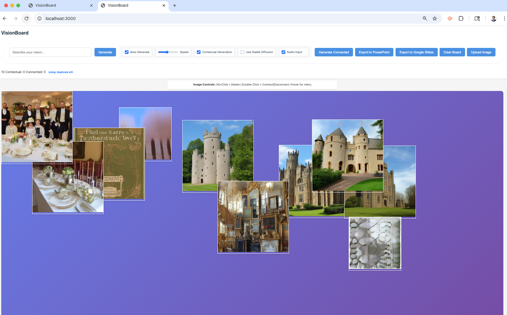

# VisionBoard AI 🎨

An intelligent mood board generator that creates AI-powered images with progressive quality enhancement, speech recognition, and smart contextual generation.



## 🎥 Demo Video

https://github.com/jacobedelsonuw/visionboard-ai/assets/demo.mov

*Watch VisionBoard AI in action: progressive image generation, voice control, and intelligent mood board creation*

## ✨ Features

### 🖼️ Progressive Image Generation
- **Multi-Quality Pipeline**: LOW (256×256, 3 steps) → MEDIUM (384×384, 8 steps) → HIGH (512×512, 15 steps) → ENHANCED_HIGH (768×768, 30 steps)
- **Instant Preview**: Show low-quality images immediately, then upgrade in background
- **Visual Feedback**: Glow effects when images upgrade to higher quality
- **Smart Optimization**: Ultra-fast 150ms polling for LOW quality, optimized settings for speed

### 🎤 Voice Control
- **Speech Recognition**: Generate images from voice commands
- **Smart Pause Detection**: 5-second silence delay before processing speech
- **Real-time Transcription**: Live display of speech input
- **Sentiment Analysis**: Emotional context detection from voice input

### 🎯 Smart Generation
- **Auto-Generation**: Continuous image creation every 5-10 seconds based on speed control
- **Contextual Generation**: AI analyzes previous images to create thematically connected content
- **Prompt Enhancement**: Replicate API integration for detailed, artistic prompt improvement
- **Connected Images**: Link images together and generate combinations

### 🖱️ Intuitive Interface
- **Perfect Drag & Drop**: Images stay at generated position, smooth 60fps dragging
- **Compact Layout**: Clean 180×180px image grid optimized for mood boards
- **Image Controls**: 
  - Alt+Click to delete
  - Double-click to connect/disconnect
  - Hover for control menu
- **Responsive Design**: Works on desktop, tablet, and mobile

### 🚀 AI Services Integration
- **Replicate API**: High-quality Stable Diffusion image generation
- **Local Stable Diffusion**: Optional local generation support
- **Prompt Enhancement**: AI-powered artistic prompt improvement
- **Background Processing**: Non-blocking progressive enhancement

## 🛠️ Installation & Setup

### Prerequisites
- Node.js (v16 or higher)
- npm or yarn
- Replicate API key

### Quick Start

1. **Clone the repository**
   ```bash
   git clone https://github.com/jacobedelsonuw/visionboard-ai.git
   cd visionboard-ai
   ```

2. **Install dependencies**
   ```bash
   npm install
   ```

3. **Set up your Replicate API key**
   ```bash
   export REPLICATE_API_TOKEN="your_api_key_here"
   ```

4. **Start the application**
   ```bash
   npm start
   ```

5. **Open your browser**
   Navigate to `http://localhost:3000`

## 🎮 Usage

### Basic Image Generation
1. Type a prompt in the text input (e.g., "mystical forest with glowing mushrooms")
2. Click "Generate" or press Enter
3. Watch as your image appears instantly in LOW quality, then upgrades automatically

### Voice Commands
1. Toggle "Audio Input" on
2. Speak your vision (e.g., "romantic sunset over mountains")
3. Wait for the 5-second pause, then watch your image generate

### Auto-Generation Mode
1. Enable "Auto Generate" toggle
2. Adjust speed slider (1-10, affects 5-15 second intervals)
3. Let the AI continuously create images based on your prompt history

### Contextual Generation
1. Enable "Contextual Generation"
2. The AI analyzes your existing images and creates thematically related content
3. Creates artistic connections between your visual concepts

### Image Management
- **Connect Images**: Double-click or use 🔗 button to link images
- **Generate Connected**: Use connected images to create combination prompts
- **Delete Images**: Alt+click or use × button
- **Drag & Drop**: Click and drag images to rearrange your mood board

## ⚙️ Configuration

Key settings in `config.js`:

```javascript
REPLICATE: {
    ENABLED: true,
    QUALITY_LEVELS: {
        LOW: { steps: 3, width: 256, height: 256, guidance_scale: 2 },
        MEDIUM: { steps: 8, width: 384, height: 384, guidance_scale: 4 },
        HIGH: { steps: 15, width: 512, height: 512, guidance_scale: 6 },
        ENHANCED_HIGH: { steps: 30, width: 768, height: 768, guidance_scale: 7.5 }
    }
},
AUTO_GENERATION: {
    ENABLED: true,
    INTERVAL: 800, // milliseconds between generations
    MAX_AUTO_IMAGES: 15
},
BACKGROUND_ENHANCEMENT: true // Enable progressive quality upgrades
```

## 🏗️ Architecture

### Core Components
- **`script.js`**: Main application logic, UI interactions, drag & drop
- **`ai-service.js`**: AI integration, progressive generation, API management
- **`config.js`**: Configuration settings and quality levels
- **`styles.css`**: Responsive design and visual effects
- **`server.cjs`**: Express server with API proxying

### Progressive Generation Flow
1. User submits prompt
2. Generate LOW quality image (3 steps, ~3-5 seconds)
3. Display immediately on mood board
4. Background: Generate MEDIUM quality
5. Background: Upgrade to HIGH quality
6. Background: Final upgrade to ENHANCED_HIGH
7. Visual feedback during each upgrade

## 🎨 Advanced Features

### Prompt Enhancement
The AI automatically enhances your prompts for better artistic results:
- Input: "castle"
- Enhanced: "Majestic medieval castle with dramatic lighting, photorealistic detail, cinematic composition, golden hour lighting, architectural masterpiece"

### Smart Contextual Generation
Analyzes your mood board content to generate related images:
- Detects themes, colors, and artistic styles
- Creates variations and complementary content
- Maintains visual cohesion across your board

### Export Options
- **Image Export**: Save your complete mood board as a single image
- **PowerPoint Export**: Generate presentation slides with your images
- **Google Slides**: Direct export to Google Slides (coming soon)

## 🚦 Performance Optimizations

- **Ultra-fast LOW quality**: 150ms polling, 3-step generation
- **RequestAnimationFrame**: Smooth 60fps drag animations
- **Background processing**: Non-blocking progressive enhancement
- **Smart caching**: Efficient image loading and display
- **Optimized polling**: Dynamic intervals based on quality level

## 🤝 Contributing

1. Fork the repository
2. Create a feature branch (`git checkout -b feature/amazing-feature`)
3. Commit your changes (`git commit -m 'Add amazing feature'`)
4. Push to the branch (`git push origin feature/amazing-feature`)
5. Open a Pull Request

## 📝 License

This project is licensed under the MIT License - see the [LICENSE](LICENSE) file for details.

## 🙏 Acknowledgments

- **Replicate** for powerful AI model hosting
- **Stable Diffusion** for incredible image generation capabilities
- **Web Speech API** for voice recognition
- **Express.js** for the robust server framework

## 📊 Stats

- **Generation Speed**: 3-5 seconds for initial preview
- **Quality Levels**: 4 progressive enhancement stages
- **Image Sizes**: 180×180px optimized display
- **Max Resolution**: 768×768px enhanced quality
- **Auto-Generation**: 5-15 second intervals
- **Speech Delay**: 5-second pause detection

---

**Created with ❤️ by Jacob Edelson**

*Transform your ideas into stunning visual mood boards with the power of AI* 